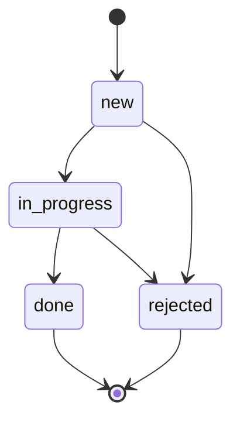
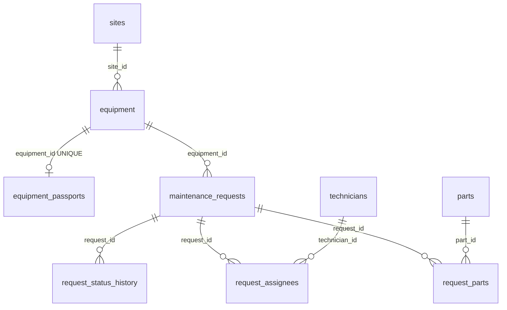

# maintenance-api

REST API на Express для учёта оборудования производственной площадки (например,
ветропарка) и заявок на его техническое обслуживание. Сервис ведёт справочник
оборудования, контролирует жизненный цикл заявок и по координатам объекта оценивает
погодные условия перед планированием наружных работ (модуль Open-Meteo из проекта
[weather-digest](https://github.com/oxolegit/weather-digest)).

Данные хранятся в PostgreSQL: схема создаётся миграциями, доступ идёт через Sequelize и
слой репозиториев. Помимо оборудования и заявок сервис ведёт площадки, технические паспорта,
специалистов с назначением бригад на заявки, неизменяемый журнал смены статусов, склад
запчастей с их списанием на заявки и аналитические отчёты на SQL. Внешний контракт
эндпоинтов Кейса 2 сохранён — прежняя коллекция Postman проходит на новой базе.

## Содержание

- [Требования к окружению](#требования-к-окружению)
- [Установка и запуск](#установка-и-запуск)
- [Переменные окружения](#переменные-окружения)
- [Эндпоинты](#эндпоинты)
- [Модель данных](#модель-данных)
- [Формат ответов и коды](#формат-ответов-и-коды)
- [Примеры запросов](#примеры-запросов)
- [База данных](#база-данных)
- [Миграции, сиды и перенос данных](#миграции-сиды-и-перенос-данных)
- [Транзакции и согласованность](#транзакции-и-согласованность)
- [Отчёты на SQL](#отчёты-на-sql)
- [Списки: фильтры, сортировка, пагинация](#списки-фильтры-сортировка-пагинация)
- [Прогноз погоды и правило пригодности](#прогноз-погоды-и-правило-пригодности)
- [Безопасность](#безопасность)
- [Middleware и обработка ошибок](#middleware-и-обработка-ошибок)
- [Логирование](#логирование)
- [Структура проекта](#структура-проекта)
- [Postman](#postman)
- [Запуск в Docker](#запуск-в-docker)
- [HTML-страница](#html-страница)
- [Разработка](#разработка)

## Требования к окружению

- Node.js 20.12 и выше (используются встроенные `fetch`, `process.loadEnvFile`, `structuredClone`).
- PostgreSQL 16. Проще всего поднять его из `compose.yaml` (нужен Docker); подойдёт и
  локальный сервер — тогда в `.env` указываются его адрес и учётные данные.
- Доступ в интернет к `api.open-meteo.com` для эндпоинта прогноза (остальной API работает без сети).

## Установка и запуск

```bash
git clone https://github.com/oxolegit/maintenance-api-pg.git
cd maintenance-api-pg
npm install
cp .env.example .env          # пароль БД и API-ключ при необходимости поменять
docker compose up -d db       # PostgreSQL 16 с томом pgdata и healthcheck
npm run db:migrate            # схема: все миграции
npm run db:seed               # демо-данные: площадки, оборудование, специалисты, заявки, запчасти
npm start
```

Сервер поднимается на `http://localhost:3000` (порт настраивается). Проверка — здоровье
процесса и соединения с базой:

```bash
curl http://localhost:3000/api/health
# {"data":{"status":"ok","uptime":3,"timestamp":"…","db":"ok"}}
```

Если база недоступна при старте, процесс завершается с кодом 1 и сообщением
`нет соединения с PostgreSQL` (хост, порт и имя базы — в записи лога); если база пропала
во время работы, `/api/health` отвечает `503` со `status: "degraded"`, а запросы к данным —
`503 DB_UNAVAILABLE`. Полностью в контейнерах (база, миграции, приложение) — см.
[Запуск в Docker](#запуск-в-docker).

Режим разработки с автоперезапуском и читаемыми логами:

```bash
npm run dev
```

## Переменные окружения

Файл `.env.example` содержит все переменные со значениями по умолчанию. Файл `.env`
в репозиторий не попадает. Приложение проверяет переменные при старте и завершается с
понятным сообщением, если значение некорректно (например, `PORT=abc`).

| Переменная                     | Назначение                                                              | По умолчанию                                  |
| ------------------------------ | ----------------------------------------------------------------------- | --------------------------------------------- |
| `PORT`                         | Порт HTTP-сервера                                                       | `3000`                                        |
| `NODE_ENV`                     | `development` / `test` / `production`                                   | `development`                                 |
| `LOG_LEVEL`                    | Уровень логирования pino                                                | `info`                                        |
| `CORS_ORIGINS`                 | Разрешённые источники CORS через запятую                                | `http://localhost:3000,http://localhost:5173` |
| `RATE_LIMIT_WINDOW_MS`         | Окно ограничения частоты, мс                                            | `60000`                                       |
| `RATE_LIMIT_MAX`               | Максимум запросов к `/api` с одного IP за окно                          | `100`                                         |
| `JSON_BODY_LIMIT`              | Максимальный размер JSON-тела                                           | `100kb`                                       |
| `DB_HOST`, `DB_PORT`           | Адрес PostgreSQL (в compose приложение ходит по `db:5432`)              | `localhost`, `5432`                           |
| `DB_NAME`, `DB_USER`           | База и пользователь; из них же compose создаёт контейнер `db`           | `maintenance`, `maintenance`                  |
| `DB_PASSWORD`                  | Пароль пользователя БД, обязателен (в коде значения нет)                | `maintenance` в `.env.example`                |
| `DB_POOL_MIN`, `DB_POOL_MAX`   | Размер пула соединений Sequelize                                        | `0`, `10`                                     |
| `DB_LOG_SQL`                   | `true` — писать SQL-запросы в лог на уровне `debug`                     | `false`                                       |
| `DB_NAME_TEST`                 | Отдельная база для автотестов                                           | `maintenance_test`                            |
| `WEATHER_API_URL`              | URL API прогноза Open-Meteo                                             | `https://api.open-meteo.com/v1/forecast`      |
| `REQUEST_TIMEOUT_MS`           | Таймаут запроса к внешнему API, мс                                      | `5000`                                        |
| `WEATHER_FORECAST_DAYS`        | Число дней прогноза по умолчанию (1–7)                                  | `3`                                           |
| `WEATHER_MAX_WIND_SPEED_MS`    | Порог ветра для наружных работ, м/с                                     | `10`                                          |
| `WEATHER_MAX_PRECIPITATION_MM` | Порог осадков для наружных работ, мм                                    | `0`                                           |
| `WEATHER_CACHE_TTL_MS`         | Время жизни кэша прогноза, мс (`0` — без кэша)                          | `600000`                                      |
| `API_KEY`                      | Ключ для изменяющих операций (заголовок `X-API-Key`); пусто — выключено | `change-me` в `.env.example`, пусто в коде    |

## Эндпоинты

Все маршруты имеют префикс `/api`. Операции, помеченные 🔒, требуют заголовок
`X-API-Key`, если задана переменная `API_KEY`.

| Метод       | Путь                          | Назначение                                                 | Успех              |
| ----------- | ----------------------------- | ---------------------------------------------------------- | ------------------ |
| `GET`       | `/api/health`                 | Проверка доступности сервиса                               | `200`              |
| `GET`       | `/api/equipment`              | Список оборудования: фильтры, сортировка, пагинация        | `200`              |
| `POST` 🔒   | `/api/equipment`              | Создание единицы оборудования                              | `201` + `Location` |
| `GET`       | `/api/equipment/:id`          | Карточка оборудования                                      | `200`              |
| `PATCH` 🔒  | `/api/equipment/:id`          | Частичное обновление                                       | `200`              |
| `DELETE` 🔒 | `/api/equipment/:id`          | Удаление (запрещено при открытых заявках)                  | `204`              |
| `GET`       | `/api/equipment/:id/requests` | Заявки по конкретной единице оборудования                  | `200`              |
| `GET`       | `/api/equipment/:id/weather`  | Прогноз по координатам и пригодность окна для работ        | `200`              |
| `GET`       | `/api/requests`               | Список заявок: фильтры, сортировка, пагинация              | `200`              |
| `POST` 🔒   | `/api/requests`               | Создание заявки                                            | `201` + `Location` |
| `POST` 🔒   | `/api/requests/batch`         | Массовый импорт заявок с отчётом по каждой записи          | `207`              |
| `GET`       | `/api/requests/:id`           | Карточка заявки                                            | `200`              |
| `PATCH` 🔒  | `/api/requests/:id`           | Редактирование полей заявки (кроме статуса и оборудования) | `200`              |
| `PATCH` 🔒  | `/api/requests/:id/status`    | Смена статуса с проверкой перехода и записью в журнал      | `200`              |
| `DELETE` 🔒 | `/api/requests/:id`           | Удаление заявки                                            | `204`              |

Добавлено в Кейсе 3 (площадки, паспорта, специалисты, бригады, журнал, запчасти, отчёты):

| Метод       | Путь                                        | Назначение                                                       | Успех              |
| ----------- | ------------------------------------------- | ---------------------------------------------------------------- | ------------------ |
| `GET`       | `/api/sites`                                | Список площадок (фильтры `region`, `q`)                          | `200`              |
| `POST` 🔒   | `/api/sites`                                | Создание площадки                                                | `201` + `Location` |
| `GET`       | `/api/sites/:id`                            | Карточка площадки                                                | `200`              |
| `PATCH` 🔒  | `/api/sites/:id`                            | Частичное обновление                                             | `200`              |
| `DELETE` 🔒 | `/api/sites/:id`                            | Удаление (запрещено, пока на площадке есть оборудование)         | `204`              |
| `GET`       | `/api/sites/:id/equipment`                  | Оборудование площадки (те же параметры, что у `/api/equipment`)  | `200`              |
| `GET`       | `/api/sites/:id/summary`                    | Сводка: заявки по статусам и приоритетам, среднее время закрытия | `200`              |
| `GET`       | `/api/equipment/:id/passport`               | Паспорт оборудования                                             | `200`              |
| `PUT` 🔒    | `/api/equipment/:id/passport`               | Создание или полная замена паспорта (1:1)                        | `201` / `200`      |
| `DELETE` 🔒 | `/api/equipment/:id/passport`               | Удаление паспорта                                                | `204`              |
| `GET`       | `/api/technicians`                          | Список специалистов (фильтры `specialization`, `q`)              | `200`              |
| `POST` 🔒   | `/api/technicians`                          | Создание специалиста                                             | `201` + `Location` |
| `GET`       | `/api/technicians/:id`                      | Карточка специалиста                                             | `200`              |
| `PATCH` 🔒  | `/api/technicians/:id`                      | Частичное обновление                                             | `200`              |
| `DELETE` 🔒 | `/api/technicians/:id`                      | Мягкое удаление (запрещено при назначениях на открытые заявки)   | `204`              |
| `GET`       | `/api/requests/:id/assignees`               | Бригада заявки                                                   | `200`              |
| `POST` 🔒   | `/api/requests/:id/assignees`               | Назначение бригады целиком (ровно один `lead`) — одна транзакция | `200`              |
| `DELETE` 🔒 | `/api/requests/:id/assignees/:technicianId` | Снятие специалиста с заявки                                      | `204`              |
| `GET`       | `/api/requests/:id/history`                 | Журнал смены статусов заявки                                     | `200`              |
| `GET`       | `/api/requests/:id/parts`                   | Запчасти, списанные на заявку                                    | `200`              |
| `POST` 🔒   | `/api/requests/:id/parts`                   | Списание запчастей со склада на заявку — одна транзакция         | `201`              |
| `DELETE` 🔒 | `/api/requests/:id/parts/:partId`           | Возврат позиции на склад                                         | `204`              |
| `GET`       | `/api/parts`                                | Склад запчастей (фильтры `q`, `inStock`)                         | `200`              |
| `POST` 🔒   | `/api/parts`                                | Создание запчасти                                                | `201` + `Location` |
| `GET`       | `/api/parts/:id`                            | Карточка запчасти с остатком                                     | `200`              |
| `PATCH` 🔒  | `/api/parts/:id`                            | Обновление, в том числе приход на склад (`stockQty`)             | `200`              |
| `DELETE` 🔒 | `/api/parts/:id`                            | Удаление (запрещено, если были списания)                         | `204`              |
| `GET`       | `/api/reports/equipment-load`               | Отчёт по нагрузке на оборудование (прямой SQL)                   | `200`              |

Единственное изменение поведения прежних эндпоинтов — требование п. 3 условия: перевести
заявку в `in_progress` без назначенной бригады нельзя (`409 REQUEST_HAS_NO_ASSIGNEES`).
В коллекции Postman перед этим шагом добавлен запрос «Назначить бригаду».

## Модель данных

### Оборудование (`equipment`)

| Поле                     | Тип                                                           | Правила                                       |
| ------------------------ | ------------------------------------------------------------- | --------------------------------------------- |
| `id`                     | string (uuid)                                                 | генерируется сервером                         |
| `siteId`                 | string (uuid) или `null`                                      | площадка; `null` — оборудование не размещено  |
| `name`                   | string                                                        | обязательное, 3–100 символов                  |
| `type`                   | `turbine` \| `inverter` \| `sensor` \| `substation`           | обязательное                                  |
| `serialNumber`           | string                                                        | обязательное, уникальное, до 64 символов      |
| `location`               | `{ lat: number, lon: number }`                                | обязательное, широта −90…90, долгота −180…180 |
| `status`                 | `operational` \| `maintenance` \| `fault` \| `decommissioned` | по умолчанию `operational`                    |
| `installedAt`            | ISO-дата (`2024-05-10` или дата-время)                        | обязательное, не в будущем; хранится как дата |
| `createdAt`, `updatedAt` | ISO-дата-время                                                | проставляются сервером                        |

В карточке (`GET /api/equipment/:id`, а также в ответах `POST` и `PATCH`) дополнительно
отдаются `site` (`id`, `name`, `code` или `null`) и `passport` (см. ниже или `null`).
Все метки времени возвращаются в UTC с миллисекундами (`2026-09-25T09:00:00.000Z`) —
так их хранит `timestamptz`; переданное клиентом смещение (`+03:00`) пересчитывается.

### Заявка на обслуживание (`request`)

| Поле                     | Тип                                            | Правила                                              |
| ------------------------ | ---------------------------------------------- | ---------------------------------------------------- |
| `id`                     | string (uuid)                                  | генерируется сервером                                |
| `equipmentId`            | string (uuid)                                  | обязательное, ссылка на существующее оборудование    |
| `title`                  | string                                         | обязательное, 5–120 символов                         |
| `description`            | string                                         | до 2000 символов, по умолчанию `""`                  |
| `priority`               | `low` \| `medium` \| `high` \| `critical`      | по умолчанию `medium`                                |
| `status`                 | `new` \| `in_progress` \| `done` \| `rejected` | при создании всегда `new`                            |
| `plannedAt`              | ISO-дата-время или `null`                      | необязательное                                       |
| `author`                 | string                                         | автор заявки, до 100 символов, по умолчанию `system` |
| `createdAt`, `updatedAt` | ISO-дата-время                                 | проставляются сервером                               |

Карточка заявки дополнительно содержит `equipment` (`id`, `name`, `serialNumber`) и
`assignees` — бригаду с ролями, часами и данными специалистов. Смена статуса принимает
необязательные `author` и `comment`, которые попадают в журнал.

Поля `id`, `createdAt`, `updatedAt` нельзя передать или изменить через API — они,
как и любые неизвестные поля тела запроса, отбрасываются валидатором. Статус заявки
меняется только через `PATCH /api/requests/:id/status`; в `POST` и `PATCH /api/requests/:id`
поле `status` игнорируется.

### Переходы статусов заявки



| Из \ В        | `new` | `in_progress` | `done` | `rejected` |
| ------------- | :---: | :-----------: | :----: | :--------: |
| `new`         |   –   |       ✔       |   –    |     ✔      |
| `in_progress` |   –   |       –       |   ✔    |     ✔      |
| `done`        |   –   |       –       |   –    |     –      |
| `rejected`    |   –   |       –       |   –    |     –      |

Таблица переходов лежит в `src/services/requestService.js`; недопустимый переход
(в том числе повтор текущего статуса) отклоняется с `409 INVALID_STATUS_TRANSITION`,
в `details` перечислены допустимые переходы из текущего статуса.

Перевод в `in_progress` возможен только при назначенной бригаде
(`409 REQUEST_HAS_NO_ASSIGNEES`); из заявки в работе нельзя снять последнего исполнителя.
Каждый переход, как и создание заявки, записывается в журнал статусов.

Заявки со статусами `new` и `in_progress` считаются открытыми: пока они есть,
оборудование удалить нельзя (`409 EQUIPMENT_HAS_OPEN_REQUESTS`). Закрытые заявки
(`done`, `rejected`) при удалении оборудования удаляются каскадом вместе с журналом и
назначениями — штатный путь вывода из эксплуатации не удаление, а статус `decommissioned`.
Создать заявку на списанное оборудование нельзя — `409 EQUIPMENT_DECOMMISSIONED`.

### Площадка (`site`)

| Поле                     | Тип                            | Правила                                                             |
| ------------------------ | ------------------------------ | ------------------------------------------------------------------- |
| `id`                     | string (uuid)                  | генерируется сервером                                               |
| `name`                   | string                         | обязательное, 2–100 символов                                        |
| `code`                   | string                         | обязательное, уникальное, `A-Z0-9-`, приводится к верхнему регистру |
| `region`                 | string                         | обязательное, 2–100 символов                                        |
| `location`               | `{ lat: number, lon: number }` | обязательное                                                        |
| `createdAt`, `updatedAt` | ISO-дата-время                 | проставляются сервером                                              |

### Паспорт оборудования (`passport`)

Один паспорт на единицу оборудования (связь 1:1), адрес — `/api/equipment/:id/passport`.

| Поле                     | Тип                 | Правила                      |
| ------------------------ | ------------------- | ---------------------------- |
| `id`, `equipmentId`      | string (uuid)       | проставляются сервером       |
| `manufacturer`, `model`  | string              | обязательные, 1–100 символов |
| `ratedPowerKw`           | number              | обязательное, больше нуля    |
| `lastInspectionAt`       | ISO-дата или `null` | дата последней поверки       |
| `createdAt`, `updatedAt` | ISO-дата-время      | проставляются сервером       |

### Специалист (`technician`)

| Поле                     | Тип            | Правила                                                                       |
| ------------------------ | -------------- | ----------------------------------------------------------------------------- |
| `id`                     | string (uuid)  | генерируется сервером                                                         |
| `fullName`               | string         | обязательное, 5–150 символов                                                  |
| `specialization`         | string         | обязательное, 2–100 символов                                                  |
| `employeeNumber`         | string         | табельный номер, уникальный среди действующих, приводится к верхнему регистру |
| `createdAt`, `updatedAt` | ISO-дата-время | проставляются сервером                                                        |

Удаление мягкое: специалист получает `deleted_at`, исчезает из списков и новых назначений,
но остаётся в бригадах закрытых заявок; его табельный номер может получить новый сотрудник.

### Бригада заявки (`assignee`)

`POST /api/requests/:id/assignees` принимает `{ "assignees": [{ "technicianId", "role", "hours" }] }`
и заменяет состав целиком. `role` — `lead` | `member` (по умолчанию `member`), `hours` —
плановые трудозатраты, число больше 0 до двух знаков после запятой. В бригаде ровно один
`lead` (`422`), специалист входит в бригаду не более одного раза (`409`), на закрытую
заявку бригаду не назначить (`409 REQUEST_CLOSED`). В ответе и в карточке заявки каждый
элемент: `technicianId`, `role`, `hours`, `technician { id, fullName, specialization, employeeNumber }`, `assignedAt`.

### Журнал статусов (`history`)

`GET /api/requests/:id/history` — записи по возрастанию `id`: `previousStatus` (`null` для
создания), `newStatus`, `author`, `comment`, `changedAt`. Журнал только пополняется:
`UPDATE` и `DELETE` отклоняет триггер в базе (`409 HISTORY_IMMUTABLE`), удаление заявки
уносит её записи каскадом.

### Запчасть (`part`) и расход по заявке

| Поле                     | Тип            | Правила                                                   |
| ------------------------ | -------------- | --------------------------------------------------------- |
| `id`                     | string (uuid)  | генерируется сервером                                     |
| `name`                   | string         | обязательное, 2–100 символов                              |
| `sku`                    | string         | артикул, уникальный, `A-Z0-9.-`, верхний регистр          |
| `unit`                   | string         | единица измерения, по умолчанию `шт`                      |
| `stockQty`               | integer        | остаток на складе, не меньше 0 (гарантирует CHECK в базе) |
| `createdAt`, `updatedAt` | ISO-дата-время | проставляются сервером                                    |

`POST /api/requests/:id/parts` с телом `{ "items": [{ "partId", "quantity" }] }` списывает
позиции на открытую заявку: остаток каждой запчасти уменьшается, повторное списание той же
запчасти суммирует количество. Нехватка любой позиции — `409 INSUFFICIENT_STOCK`, и ни одна
строка не изменяется. `DELETE /api/requests/:id/parts/:partId` возвращает позицию на склад.

## Формат ответов и коды

Одиночный объект всегда лежит в `data`, список — в `data` с метаданными в `meta`:

```json
{ "data": { "id": "…", "name": "…" } }
```

```json
{
  "data": [{ "id": "…" }],
  "meta": { "total": 42, "page": 2, "limit": 20, "pages": 3 }
}
```

Все ошибки имеют единый формат. `requestId` совпадает с заголовком `X-Request-Id`
ответа и с записью в логах сервера. `details` присутствует у ошибок валидации и
конфликтов, где есть что уточнить по полям:

```json
{
  "error": {
    "code": "VALIDATION_ERROR",
    "message": "Некорректные данные запроса",
    "details": [
      {
        "field": "priority",
        "message": "Допустимые значения: low, medium, high, critical",
        "location": "body"
      }
    ],
    "requestId": "b1f2c3d4"
  }
}
```

| Код           | Когда                                                                                 | `error.code`                                                                                                                                                                                                                                                                                                                   |
| ------------- | ------------------------------------------------------------------------------------- | ------------------------------------------------------------------------------------------------------------------------------------------------------------------------------------------------------------------------------------------------------------------------------------------------------------------------------ |
| `200`         | Успешное чтение или обновление                                                        | —                                                                                                                                                                                                                                                                                                                              |
| `201`         | Сущность создана, в заголовке `Location` — её адрес                                   | —                                                                                                                                                                                                                                                                                                                              |
| `204`         | Сущность удалена, тело пустое                                                         | —                                                                                                                                                                                                                                                                                                                              |
| `207`         | Массовый импорт: результат по каждой записи внутри тела                               | —                                                                                                                                                                                                                                                                                                                              |
| `400`         | Запрос синтаксически некорректен: битый JSON, неверные параметры пути или query       | `INVALID_JSON`, `VALIDATION_ERROR`                                                                                                                                                                                                                                                                                             |
| `401`         | Нет или неверный `X-API-Key` на изменяющей операции                                   | `UNAUTHORIZED`                                                                                                                                                                                                                                                                                                                 |
| `404`         | Сущность или маршрут не найдены, в т.ч. ссылка на несуществующую связанную запись     | `NOT_FOUND`, `EQUIPMENT_NOT_FOUND`, `SITE_NOT_FOUND`, `TECHNICIAN_NOT_FOUND`, `PART_NOT_FOUND`, `PASSPORT_NOT_FOUND`, `ASSIGNEE_NOT_FOUND`, `REQUEST_PART_NOT_FOUND`, `RELATED_NOT_FOUND`, `ROUTE_NOT_FOUND`                                                                                                                   |
| `409`         | Конфликт с текущим состоянием данных или ограничением базы                            | `SERIAL_NUMBER_TAKEN`, `INVALID_STATUS_TRANSITION`, `EQUIPMENT_HAS_OPEN_REQUESTS`, `EQUIPMENT_DECOMMISSIONED`, `REQUEST_HAS_NO_ASSIGNEES`, `REQUEST_CLOSED`, `SITE_HAS_EQUIPMENT`, `TECHNICIAN_ASSIGNED`, `INSUFFICIENT_STOCK`, `PART_IN_USE`, `UNIQUE_VIOLATION`, `RESOURCE_IN_USE`, `HISTORY_IMMUTABLE`, `CONCURRENT_UPDATE` |
| `413`         | Тело запроса больше `JSON_BODY_LIMIT`                                                 | `PAYLOAD_TOO_LARGE`                                                                                                                                                                                                                                                                                                            |
| `422`         | Тело запроса разобрано, но не проходит правила предметной области (длины, enum, даты) | `VALIDATION_ERROR`                                                                                                                                                                                                                                                                                                             |
| `429`         | Превышен лимит частоты запросов                                                       | `RATE_LIMITED`                                                                                                                                                                                                                                                                                                                 |
| `502` / `504` | Внешний погодный сервис ответил ошибкой / не ответил за `REQUEST_TIMEOUT_MS`          | `UPSTREAM_ERROR`, `UPSTREAM_TIMEOUT`                                                                                                                                                                                                                                                                                           |
| `500`         | Непредвиденная ошибка; в production без внутренних деталей                            | `INTERNAL_ERROR`                                                                                                                                                                                                                                                                                                               |
| `503`         | База данных недоступна                                                                | `DB_UNAVAILABLE`                                                                                                                                                                                                                                                                                                               |

Ошибки базы данных не доходят до клиента как `500`: нарушение уникальности становится
`409 UNIQUE_VIOLATION` с именем поля, ссылка на отсутствующую запись — `404 RELATED_NOT_FOUND`,
попытка удалить запись, на которую ссылаются (`ON DELETE RESTRICT`) — `409 RESOURCE_IN_USE`
с именем таблицы, нарушение `CHECK` — `422`, неверный литерал (`uuid`, enum) — `400`,
исключение триггера журнала — `409 HISTORY_IMMUTABLE`, взаимная блокировка —
`409 CONCURRENT_UPDATE`. Преобразование лежит в `src/db/errors.js` и вызывается из
единого обработчика ошибок; сервисы, как и раньше, бросают свои типы ошибок.

Разделение `400`/`422`: `400` — запрос нельзя обработать в принципе (нечитаемое тело,
`page=0`, идентификатор не в формате UUID), `422` — запрос понятен, но данные
нарушают бизнес-правила модели (короткое название, неизвестный приоритет, дата установки
в будущем). Каждая ошибка валидации перечисляет все проблемные поля с причиной и
местом (`body`, `params`, `query`).

## Примеры запросов

Создание оборудования:

```bash
curl -i -X POST http://localhost:3000/api/equipment \
  -H "Content-Type: application/json" -H "X-API-Key: change-me" \
  -d '{
    "name": "Ветротурбина ВТ-01",
    "type": "turbine",
    "serialNumber": "WT-2024-001",
    "location": { "lat": 55.7522, "lon": 37.6156 },
    "installedAt": "2024-05-10"
  }'
```

```http
HTTP/1.1 201 Created
Location: /api/equipment/0f1b6f0e-2f5e-4a60-9f7e-1c0b8d5b1a11
X-Request-Id: 3f9a1c2b
Content-Type: application/json; charset=utf-8

{
  "data": {
    "id": "0f1b6f0e-2f5e-4a60-9f7e-1c0b8d5b1a11",
    "name": "Ветротурбина ВТ-01",
    "type": "turbine",
    "serialNumber": "WT-2024-001",
    "location": { "lat": 55.7522, "lon": 37.6156 },
    "status": "operational",
    "installedAt": "2024-05-10",
    "createdAt": "2026-09-20T17:25:34.941Z",
    "updatedAt": "2026-09-20T17:25:34.941Z"
  }
}
```

Повторный запрос с тем же серийным номером:

```json
{
  "error": {
    "code": "SERIAL_NUMBER_TAKEN",
    "message": "Серийный номер WT-2024-001 уже занят",
    "details": [{ "field": "serialNumber", "message": "Серийный номер уже занят" }],
    "requestId": "51bea6e7"
  }
}
```

Создание заявки:

```bash
curl -X POST http://localhost:3000/api/requests \
  -H "Content-Type: application/json" -H "X-API-Key: change-me" \
  -d '{
    "equipmentId": "0f1b6f0e-2f5e-4a60-9f7e-1c0b8d5b1a11",
    "title": "Замена подшипника главного вала",
    "priority": "high",
    "plannedAt": "2026-10-05T09:00:00Z"
  }'
```

```json
{
  "data": {
    "id": "e0a19e2e-825a-4414-925e-0a035d53b2dd",
    "equipmentId": "0f1b6f0e-2f5e-4a60-9f7e-1c0b8d5b1a11",
    "title": "Замена подшипника главного вала",
    "description": "",
    "priority": "high",
    "plannedAt": "2026-10-05T09:00:00Z",
    "status": "new",
    "createdAt": "2026-09-20T17:28:43.922Z",
    "updatedAt": "2026-09-20T17:28:43.922Z"
  }
}
```

Заявка на несуществующее оборудование — `404`:

```json
{
  "error": {
    "code": "EQUIPMENT_NOT_FOUND",
    "message": "Оборудование 11111111-1111-4111-8111-111111111111 не найдено",
    "requestId": "2572a687"
  }
}
```

Некорректное тело заявки — `422` с перечнем полей:

```json
{
  "error": {
    "code": "VALIDATION_ERROR",
    "message": "Некорректные данные запроса",
    "details": [
      { "field": "title", "message": "Длина должна быть от 5 до 120 символов", "location": "body" },
      {
        "field": "priority",
        "message": "Допустимые значения: low, medium, high, critical",
        "location": "body"
      },
      {
        "field": "plannedAt",
        "message": "Ожидается дата и время в формате ISO 8601",
        "location": "body"
      }
    ],
    "requestId": "7f3d7574"
  }
}
```

Смена статуса:

```bash
curl -X PATCH http://localhost:3000/api/requests/e0a19e2e-825a-4414-925e-0a035d53b2dd/status \
  -H "Content-Type: application/json" -H "X-API-Key: change-me" \
  -d '{ "status": "done" }'
```

Из `new` сразу в `done` нельзя — `409`:

```json
{
  "error": {
    "code": "INVALID_STATUS_TRANSITION",
    "message": "Переход из статуса new в done недопустим",
    "details": [
      { "field": "status", "message": "Из статуса new допустимы переходы: in_progress, rejected" }
    ],
    "requestId": "9c52bcf9"
  }
}
```

Удаление оборудования с открытой заявкой — `409`:

```json
{
  "error": {
    "code": "EQUIPMENT_HAS_OPEN_REQUESTS",
    "message": "Нельзя удалить оборудование: по нему есть незакрытые заявки (1)",
    "requestId": "d13c0f3d"
  }
}
```

Массовый импорт (`207`, каждая запись обрабатывается независимо):

```bash
curl -X POST http://localhost:3000/api/requests/batch \
  -H "Content-Type: application/json" -H "X-API-Key: change-me" \
  -d '{ "items": [
    { "equipmentId": "0f1b6f0e-2f5e-4a60-9f7e-1c0b8d5b1a11", "title": "Плановый осмотр гондолы" },
    { "equipmentId": "11111111-1111-4111-8111-111111111111", "title": "Заявка в никуда" },
    { "equipmentId": "0f1b6f0e-2f5e-4a60-9f7e-1c0b8d5b1a11", "title": "Кор" }
  ] }'
```

```json
{
  "data": {
    "summary": { "total": 3, "created": 1, "failed": 2 },
    "results": [
      { "index": 0, "status": 201, "data": { "id": "…", "status": "new", "…": "…" } },
      {
        "index": 1,
        "status": 404,
        "error": { "code": "EQUIPMENT_NOT_FOUND", "message": "Оборудование … не найдено" }
      },
      {
        "index": 2,
        "status": 422,
        "error": {
          "code": "VALIDATION_ERROR",
          "message": "Некорректные данные запроса",
          "details": [{ "field": "title", "message": "Длина должна быть от 5 до 120 символов" }]
        }
      }
    ]
  }
}
```

Изменяющая операция без ключа — `401`:

```json
{
  "error": {
    "code": "UNAUTHORIZED",
    "message": "Для изменяющих операций требуется заголовок X-API-Key",
    "requestId": "9834e6b9"
  }
}
```

Назначение бригады (идентификаторы — из демо-данных `npm run db:seed`):

```bash
curl -X POST http://localhost:3000/api/requests/40000000-0000-4000-8000-000000000002/assignees \
  -H "Content-Type: application/json" -H "X-API-Key: change-me" \
  -d '{
    "assignees": [
      { "technicianId": "30000000-0000-4000-8000-000000000003", "role": "lead", "hours": 6 },
      { "technicianId": "30000000-0000-4000-8000-000000000004", "role": "member", "hours": 4 }
    ]
  }'
```

```json
{
  "data": [
    {
      "technicianId": "30000000-0000-4000-8000-000000000003",
      "role": "lead",
      "hours": 6,
      "technician": {
        "id": "30000000-0000-4000-8000-000000000003",
        "fullName": "Бекиров Руслан Энверович",
        "specialization": "механик",
        "employeeNumber": "T-103"
      },
      "assignedAt": "2026-09-22T10:08:55.805Z"
    },
    {
      "technicianId": "30000000-0000-4000-8000-000000000004",
      "role": "member",
      "hours": 4,
      "technician": { "…": "…" },
      "assignedAt": "2026-09-22T10:08:55.805Z"
    }
  ]
}
```

Бригада без ведущего — `422`, и прежний состав остаётся на месте (транзакция откатывается):

```json
{
  "error": {
    "code": "VALIDATION_ERROR",
    "message": "Некорректные данные запроса",
    "details": [
      {
        "field": "assignees",
        "message": "В бригаде должен быть ровно один ведущий (lead), передано: 0"
      }
    ],
    "requestId": "f2e0a0b3"
  }
}
```

Смена статуса с автором и комментарием, затем журнал:

```bash
curl -X PATCH http://localhost:3000/api/requests/40000000-0000-4000-8000-000000000002/status \
  -H "Content-Type: application/json" -H "X-API-Key: change-me" \
  -d '{ "status": "in_progress", "author": "Кравченко И. В.", "comment": "бригада выехала" }'
curl http://localhost:3000/api/requests/40000000-0000-4000-8000-000000000002/history
```

```json
{
  "data": [
    {
      "id": 57,
      "requestId": "40000000-…-000000000002",
      "previousStatus": null,
      "newStatus": "new",
      "author": "dispatcher",
      "comment": null,
      "changedAt": "2026-09-18T09:00:00.000Z"
    },
    {
      "id": 58,
      "requestId": "40000000-…-000000000002",
      "previousStatus": "new",
      "newStatus": "in_progress",
      "author": "Кравченко И. В.",
      "comment": "бригада выехала",
      "changedAt": "2026-09-22T10:08:55.885Z"
    }
  ]
}
```

Сводка по площадке (`from`/`to` — необязательный период по дате создания заявки):

```bash
curl "http://localhost:3000/api/sites/10000000-0000-4000-8000-000000000001/summary?from=2026-01-01"
```

```json
{
  "data": {
    "siteId": "10000000-0000-4000-8000-000000000001",
    "siteName": "Останинская ВЭС",
    "period": { "from": "2026-01-01", "to": null },
    "total": 12,
    "open": 6,
    "byStatus": { "new": 2, "in_progress": 4, "done": 5, "rejected": 1 },
    "byPriority": { "low": 4, "medium": 3, "high": 3, "critical": 2 },
    "closed": 5,
    "avgCloseHours": 96
  }
}
```

Отчёт по нагрузке (только оборудование площадки с двумя и более заявками, по две на страницу):

```bash
curl "http://localhost:3000/api/reports/equipment-load?siteId=10000000-0000-4000-8000-000000000001&minRequests=2&limit=2"
```

```json
{
  "data": [
    {
      "equipmentId": "20000000-0000-4000-8000-000000000001",
      "name": "Ветротурбина ВТ-01",
      "serialNumber": "WT-2024-001",
      "type": "turbine",
      "status": "operational",
      "site": { "id": "10000000-0000-4000-8000-000000000001", "name": "Останинская ВЭС" },
      "requestsTotal": 3,
      "requestsDone": 1,
      "requestsOpen": 2,
      "plannedHours": 36,
      "lastMaintenanceAt": "2026-06-06T09:00:00.000Z"
    },
    {
      "equipmentId": "20000000-0000-4000-8000-000000000002",
      "name": "Ветротурбина ВТ-02",
      "…": "…"
    }
  ],
  "meta": { "total": 4, "page": 1, "limit": 2, "pages": 2 }
}
```

Списание запчастей, где второй позиции не хватает, — `409`, остаток первой не меняется:

```bash
curl -X POST http://localhost:3000/api/requests/40000000-0000-4000-8000-000000000002/parts \
  -H "Content-Type: application/json" -H "X-API-Key: change-me" \
  -d '{ "items": [
    { "partId": "50000000-0000-4000-8000-000000000002", "quantity": 2 },
    { "partId": "50000000-0000-4000-8000-000000000004", "quantity": 2 }
  ] }'
```

```json
{
  "error": {
    "code": "INSUFFICIENT_STOCK",
    "message": "Недостаточно остатка запчасти Лопасть V90 (секция)",
    "details": [{ "field": "items", "message": "BLD-V90: запрошено 2, на складе 1" }],
    "requestId": "1126dc55"
  }
}
```

## База данных

Схема из девяти таблиц в третьей нормальной форме, полное описание с ER-диаграммой,
обоснованием нормализации и правилами удаления — в [docs/db/schema.md](docs/db/schema.md).



| Связь                    | Тип | Реализация                                                                                                               |
| ------------------------ | --- | ------------------------------------------------------------------------------------------------------------------------ |
| Площадка → Оборудование  | 1:N | `equipment.site_id` (может быть `NULL`), `ON DELETE RESTRICT`                                                            |
| Оборудование → Паспорт   | 1:1 | `equipment_passports.equipment_id UNIQUE`, `ON DELETE CASCADE`                                                           |
| Оборудование → Заявки    | 1:N | `maintenance_requests.equipment_id`, `ON DELETE CASCADE`                                                                 |
| Заявка → Журнал статусов | 1:N | `request_status_history.request_id`, `ON DELETE CASCADE`; триггер запрещает `UPDATE`/`DELETE`                            |
| Заявки ↔ Специалисты     | N:M | `request_assignees (request_id, technician_id)` с `role`, `hours`; частичный уникальный индекс — не больше одного `lead` |
| Заявки ↔ Запчасти        | N:M | `request_parts (request_id, part_id)` с `quantity`; `parts.part_id ON DELETE RESTRICT`                                   |

Ключевые решения:

- **Именованные перечисления** (`equipment_type`, `equipment_status`, `request_priority`,
  `request_status`, `assignee_role`): один тип `request_status` используется и в заявке, и в
  обеих колонках журнала. `timestamptz` для моментов времени, `date` для дат установки и
  поверки, `numeric` для координат и часов, `integer` для количеств; значения по умолчанию
  (`status`, `priority`, `author`, `unit`, `stock_qty`) заданы в схеме.
- **Целостность в базе**: `NOT NULL`, `UNIQUE` (серийный номер, код площадки, артикул,
  табельный номер среди действующих сотрудников), внешние ключи с явными правилами
  `ON DELETE`, `CHECK` на положительные часы, мощность и количество и на неотрицательный
  остаток. Сервис дублирует только те проверки, где нужен понятный ответ клиенту.
- **Правила удаления**: площадка с оборудованием и запчасть с расходом не удаляются
  (`RESTRICT` → `409`); оборудование без открытых заявок уносит паспорт, закрытые заявки,
  их журнал, назначения и расход каскадом; специалист удаляется мягко (`paranoid`), физически
  удалить назначенного не даст `RESTRICT`.
- **Модели Sequelize** (`src/db/models/`) зеркалят миграции — тест `tests/models.test.js`
  сверяет каждый атрибут с `describeTable`. Ассоциации описаны явно в обе стороны:
  `hasOne`/`belongsTo` для паспорта, `hasMany`/`belongsTo` для оборудования, заявок и
  журнала, `belongsToMany` через `RequestAssignee` и `RequestPart` с полями связи.
- **Подключение** создаётся один раз в `src/server.js` (`src/db/sequelize.js`, пул из
  `DB_POOL_*`), проверяется `authenticate()` на старте и закрывается при остановке после
  HTTP-сервера. Приложение подключается под выделенным пользователем `DB_USER` — владельцем
  своей базы, а не суперпользователем `postgres`.

## Миграции, сиды и перенос данных

Схема создаётся только миграциями (`sync` нигде не вызывается). Миграции и сиды — ES-модули
в `migrations/` и `seeders/` с функциями `up`/`down`, выполняет их [umzug](https://github.com/sequelize/umzug) —
движок, на котором построен `sequelize-cli`; выбран напрямую, потому что проект на ESM.
Выполненные файлы отмечаются в таблицах `sequelize_meta` и `sequelize_seeds`. Каждая
миграция работает в одной транзакции: либо применяется целиком, либо не оставляет следов.

| Команда                                                         | Действие                                                     |
| --------------------------------------------------------------- | ------------------------------------------------------------ |
| `npm run db:migrate`                                            | применить все невыполненные миграции                         |
| `npm run db:migrate:status`                                     | показать невыполненные                                       |
| `npm run db:migrate:undo`                                       | откатить последнюю                                           |
| `npm run db:migrate:undo:all`                                   | откатить все (`down --to 0`)                                 |
| `npm run db:seed`                                               | загрузить демо-данные (повторный запуск ничего не дублирует) |
| `npm run db:seed:undo`, `db:seed:undo:all`                      | убрать демо-данные                                           |
| `npm run db:import -- --dir data [--dry-run]`                   | перенести JSON-файлы хранилища Кейса 2                       |
| `node scripts/migrate.js create --name 0011-x.js --prefix NONE` | заготовка новой миграции                                     |

Порядок миграций: `0001` площадки → `0002` оборудование и его перечисления → `0003`
паспорта → `0004` заявки → `0005` журнал статусов и триггер неизменяемости → `0006`
специалисты → `0007` бригады → `0008` запчасти → `0009` индексы → `0010` расширение
`pg_trgm` и триграммные индексы. Таблицы создаются раньше зависящих от них; у каждой
миграции рабочий откат — цикл «применить все → откатить все → применить снова»
проверяется тестом `tests/migrations.test.js` и командами:

```bash
npm run db:migrate:undo:all && npm run db:migrate
```

Демо-сиды (`seeders/0001-demo.js`, `0002-parts.js`): три ветропарка Крыма, 8 единиц
оборудования с паспортами, 6 специалистов, 24 заявки во всех статусах с согласованным
журналом и бригадами, 8 запчастей с расходом по закрытым заявкам. Идентификаторы
фиксированы (`10000000-…` площадки, `20000000-…` оборудование, `30000000-…` специалисты,
`40000000-…` заявки, `50000000-…` запчасти), поэтому на них ссылаются README и коллекция Postman.

Данные файлового хранилища Кейса 2 (`data/equipment.json`, `data/requests.json`)
переносятся скриптом `scripts/import-json.js`: идентификаторы и метки времени сохраняются,
координаты раскладываются в две колонки, у каждой заявки появляется журнал (создание и,
если статус менялся, переход), уже перенесённые записи пропускаются; `--dry-run` только
считает записи.

Восстановление окружения с нуля: `docker compose down -v` удаляет том с базой, после чего
`docker compose up -d db`, `npm run db:migrate`, `npm run db:seed` собирают его заново.

## Транзакции и согласованность

Сервисы не импортируют Sequelize: репозитории принимают `{ transaction, lock }`, а
`createRepositories` отдаёт функцию `transaction(work)` — управляемую транзакцию, которая
фиксируется по завершении `work` и откатывается при любом исключении, освобождая соединение
в обоих случаях. Транзакция передаётся во все запросы операции.

| Операция                                           | Что внутри одной транзакции                                                                                                       |
| -------------------------------------------------- | --------------------------------------------------------------------------------------------------------------------------------- |
| `POST /api/requests`                               | вставка заявки + запись `null → new` в журнал                                                                                     |
| `PATCH /api/requests/:id/status`                   | `SELECT … FOR UPDATE` заявки → проверка перехода → для `in_progress` проверка бригады → `UPDATE` → запись в журнал                |
| `POST /api/requests/:id/assignees`                 | блокировка заявки → удаление прежнего состава → вставка нового → проверка «ровно один lead» (`422` → откат)                       |
| `DELETE /api/requests/:id/assignees/:technicianId` | блокировка заявки → проверка, что у заявки в работе остаётся исполнитель → удаление                                               |
| `POST /api/requests/:id/parts`                     | блокировка заявки → по каждой позиции условный `UPDATE parts SET stock_qty = stock_qty - n WHERE stock_qty >= n` → строка расхода |
| `DELETE /api/requests/:id/parts/:partId`           | блокировка заявки → удаление строки расхода → возврат количества на склад                                                         |

Конкурентность: строка заявки блокируется `FOR UPDATE`, поэтому два одновременных перехода
статуса выстраиваются в очередь — второй перечитывает уже изменённую строку и получает
`409 INVALID_STATUS_TRANSITION`; частичный уникальный индекс «один lead на заявку» и условное
уменьшение остатка страхуют правила на уровне базы даже вне очереди. Позиции списания
обрабатываются в порядке `partId`, чтобы параллельные списания брали блокировки в одном
порядке и не приводили к взаимной блокировке. Всё это покрыто тестами с `Promise.all`
(`tests/history.test.js`, `tests/parts.test.js`).

Сценарий отката для защиты: назначить бригаду из существующего специалиста и случайного
UUID — первая строка вставляется, вторая нарушает внешний ключ, ответ `404`, прежняя бригада
на месте; списать две позиции, второй из которых не хватает, — ответ `409`, остаток первой
не изменился (`GET /api/parts/:id`).

## Отчёты на SQL

`GET /api/reports/equipment-load` реализован прямым запросом
(`src/repositories/reportRepository.js`): `equipment` соединяется с `sites`, заявками за
период (условие периода в `ON`, чтобы оборудование без заявок не выпадало при
`minRequests=0`) и двумя `LATERAL`-подзапросами — сумма часов бригады и дата последнего
перехода в `done` по журналу; подзапросы не размножают строки заявок, поэтому `COUNT` не
искажается. Группировка `GROUP BY e.id, s.id`, фильтрация групп `HAVING COUNT(r.id) >= $4`,
агрегаты `COUNT(...) FILTER (WHERE …)`, `COALESCE(SUM(...), 0)`, `MAX(...)`. Отдельный запрос
считает число групп для `meta.total`.

Параметры (`from`, `to`, `siteId`, `minRequests`, `limit`, `offset`) передаются только через
`bind` (`$1…$6`); поле сортировки из запроса никогда не попадает в SQL — оно проверяется по
белому списку в валидаторе и переводится в выражение `ORDER BY` по таблице в репозитории.
`limit` ограничен 100, `page` — 10 000.

Сводка `GET /api/sites/:id/summary` — два агрегирующих запроса: количество заявок по парам
«статус × приоритет» и среднее время закрытия
(`AVG(h.changed_at - r.created_at)` по строкам журнала с `new_status = 'done'`, в часах).
Тот же результат средствами ORM выглядел бы как `MaintenanceRequest.findAll({ attributes:
["status", "priority", [fn("COUNT", col("id")), "count"]], include: [{ model: Equipment,
where: { siteId } }], group: [...] })` — на защите можно показать оба варианта.

## Списки: фильтры, сортировка, пагинация

Общие параметры для `GET /api/equipment`, `GET /api/requests` и
`GET /api/equipment/:id/requests`:

| Параметр | Значение                      | По умолчанию |
| -------- | ----------------------------- | ------------ |
| `page`   | номер страницы, целое 1–10000 | `1`          |
| `limit`  | размер страницы, целое 1–100  | `20`         |
| `sort`   | поле сортировки (см. ниже)    | `createdAt`  |
| `order`  | `asc` \| `desc`               | `desc`       |

Оборудование: фильтры `type`, `status`, `installedFrom`, `installedTo` (даты `ГГГГ-ММ-ДД`,
границы включительно), `q` — подстрока в названии или серийном номере без учёта регистра;
сортировка по `createdAt`, `updatedAt`, `name`, `type`, `status`, `installedAt`.

Заявки: фильтры `status`, `priority`, `equipmentId`, `createdFrom`/`createdTo`,
`plannedFrom`/`plannedTo`, `q` — подстрока в теме или описании; сортировка по `createdAt`,
`updatedAt`, `plannedAt`, `title`, `status`. Во вложенном ресурсе `equipmentId` берётся из пути.

Площадки: `region`, `q` (название или код); специалисты: `specialization`, `q` (ФИО или
табельный номер), сортировка по умолчанию — `fullName`; запчасти: `q` (название или артикул),
`inStock=true|false`.

Фильтрация, сортировка и пагинация выполняются базой (`WHERE`, `ORDER BY … NULLS LAST`,
`LIMIT/OFFSET`, `COUNT` отдельным запросом); поиск по подстроке — `ILIKE` без учёта регистра
с триграммными индексами (см. [docs/db/indexes.md](docs/db/indexes.md)). Поле сортировки
проверяется по белому списку и переводится в имя колонки моделью — произвольное значение из
запроса в `ORDER BY` не попадает.

Все параметры проверяются: неизвестное поле сортировки или `limit=500` дают `400` с
описанием проблемы.

```bash
curl "http://localhost:3000/api/requests?status=new&priority=high&createdFrom=2026-09-01&sort=plannedAt&order=asc&page=1&limit=10"
```

## Прогноз погоды и правило пригодности

`GET /api/equipment/:id/weather?days=3` берёт координаты оборудования и запрашивает у
Open-Meteo дневной прогноз (`days` — 1–7, по умолчанию `WEATHER_FORECAST_DAYS`).
Клиент внешнего API (`src/clients/http.js`, `src/clients/openMeteo.js`) перенесён из
проекта weather-digest и подключён как отдельный сервис `src/services/weatherService.js`.

Правило пригодности окна задаётся в конфигурации: день подходит для наружных работ,
если `precipitation <= WEATHER_MAX_PRECIPITATION_MM` **и**
`windSpeedMax <= WEATHER_MAX_WIND_SPEED_MS`. По умолчанию — без осадков и ветер до 10 м/с.

```json
{
  "data": {
    "equipmentId": "0f1b6f0e-2f5e-4a60-9f7e-1c0b8d5b1a11",
    "equipmentName": "Ветротурбина ВТ-01",
    "location": { "lat": 55.7522, "lon": 37.6156 },
    "generatedAt": "2026-09-20T17:30:24.048Z",
    "rule": { "maxWindSpeedMs": 10, "maxPrecipitationMm": 0 },
    "days": [
      {
        "date": "2026-09-20",
        "tempMin": 9.9,
        "tempMax": 18.9,
        "precipitation": 0,
        "windSpeedMax": 3.2,
        "windGustsMax": 8.9,
        "suitable": true,
        "reasons": []
      },
      {
        "date": "2026-09-21",
        "tempMin": 13.3,
        "tempMax": 18.9,
        "precipitation": 6.5,
        "windSpeedMax": 3.1,
        "windGustsMax": 8.8,
        "suitable": false,
        "reasons": ["осадки 6.5 мм выше порога 0 мм"]
      }
    ],
    "hasSuitableWindow": true,
    "nextSuitableDate": "2026-09-20"
  }
}
```

Ответ кэшируется в памяти на `WEATHER_CACHE_TTL_MS` по координатам и числу дней, чтобы не
дёргать внешний API на каждый запрос. Недоступность Open-Meteo не роняет сервис: ошибка
или неверный ответ дают `502 UPSTREAM_ERROR`, превышение таймаута — `504 UPSTREAM_TIMEOUT`,
оба — в едином формате с понятным сообщением; подробности пишутся в лог.

## Безопасность

**CORS.** Список разрешённых источников задаётся переменной `CORS_ORIGINS` и никогда не
равен `*`. По умолчанию разрешены `http://localhost:3000` (сама страница из `public/`, ей
CORS фактически не нужен — тот же origin) и `http://localhost:5173` (dev-сервер Vite для
отдельного фронтенда). Для чужого origin заголовки `Access-Control-*` не выдаются, и браузер
блокирует ответ. Разрешены методы `GET, POST, PATCH, DELETE`, заголовки
`Content-Type, X-API-Key, X-Request-Id`; клиенту открыты `Location, X-Request-Id, RateLimit*,
Retry-After`. Preflight кэшируется на 10 минут.

**Ограничение частоты.** На все маршруты `/api` действует лимит `RATE_LIMIT_MAX` запросов с
одного IP за `RATE_LIMIT_WINDOW_MS`. Ответы содержат заголовки `RateLimit` и
`RateLimit-Policy` (draft-7); при превышении — `429 RATE_LIMITED` и `Retry-After`.

**Размер тела и заголовки.** JSON-тело ограничено `JSON_BODY_LIMIT` (превышение — `413`).
`helmet` выставляет защитные заголовки (`Content-Security-Policy`, `X-Content-Type-Options`,
`X-Frame-Options`, `Strict-Transport-Security` и др.), `X-Powered-By` отключён.

**API-ключ.** Если задан `API_KEY`, все `POST`, `PATCH`, `DELETE` требуют заголовок
`X-API-Key`; сравнение ключей выполняется за постоянное время (`crypto.timingSafeEqual`).
Чтение остаётся открытым. Пустой `API_KEY` отключает проверку — при старте пишется
предупреждение, для production так делать не стоит.

**Cookie.** Сервис не использует cookie и сессии: аутентификация — по заголовку, состояние
на сервере не хранится, поэтому CSRF-риск отсутствует. Если бы токен выдавался в cookie, он
был бы `HttpOnly` (недоступен скриптам), `Secure` (только по HTTPS) и `SameSite=Strict`:
API не должен получать cookie при переходах с других сайтов, а фронтенд из списка
`CORS_ORIGINS` работает на том же сайте либо использует заголовок. `Lax` понадобился бы
только для навигационных `GET` со сторонних ресурсов, которых у API нет.

**Секреты.** В репозитории нет `.env` и реальных ключей — только `.env.example` с
плейсхолдерами. В production (`NODE_ENV=production`) ответы `500` не содержат сообщений
внутренних ошибок и стек-трейсов; они остаются только в логах.

## Middleware и обработка ошибок

Порядок подключения в `src/app.js`:

1. `requestId` — присваивает идентификатор (или принимает `X-Request-Id` клиента) и
   возвращает его в заголовке. Стоит первым, чтобы идентификатор был у всех последующих
   слоёв, включая логгер и ошибки разбора JSON.
2. `requestLogger` — на завершении ответа пишет метод, путь, код, длительность и
   `requestId`. Подключён до защитных middleware, чтобы отклонённые запросы (429, CORS)
   тоже попадали в лог.
3. `helmet`, `cors`, `rateLimit` — защита срабатывает до разбора тела: лишнюю работу для
   заблокированных запросов не делаем, preflight обрабатывается до лимитера.
4. `apiKeyAuth` — проверка ключа на изменяющих операциях `/api`; стоит до разбора тела,
   чтобы не тратить ресурсы на запросы без ключа.
5. `express.json({ limit })` — разбор JSON с ограничением размера.
6. Маршруты `/api` и статика `public/`: на каждом маршруте `validate({ body, params, query })` с Zod-схемами из
   `src/validators/`. Валидатор отбрасывает неизвестные поля и складывает результат в
   `req.validated`, контроллеры работают только с проверенными данными.
7. `notFound` — любой незнакомый маршрут превращается в `404 ROUTE_NOT_FOUND`.
8. `errorHandler` — единственное место, где ошибки превращаются в HTTP-ответы.

Ошибки приложения описаны собственными типами в `src/errors/index.js` (`AppError` и
наследники `ValidationError`, `NotFoundError`, `ConflictError`, `UnauthorizedError`,
`TooManyRequestsError`, `UpstreamError` и др.) и не зависят от Express: сервисы и
репозитории бросают их, не зная о HTTP. Обработчик ошибок сопоставляет тип с кодом ответа,
ошибки body-parser (`entity.parse.failed`, `entity.too.large`) переводит в `400`/`413`,
всё остальное — в `500` с записью в лог.

Асинхронные ошибки контроллеров не теряются: используется Express 5, который передаёт
отклонённый промис обработчика в `next(err)` автоматически, поэтому обёртки над каждым
обработчиком не нужны. На уровне процесса `src/server.js` перехватывает
`unhandledRejection` и `uncaughtException`, пишет `fatal` в лог и корректно останавливает
сервер.

## Логирование

Используется `pino` с уровнями `fatal … trace` (`LOG_LEVEL`). Каждый запрос логируется
одной записью: `method`, `path`, `status`, `durationMs`, `requestId` — уровень `info` для
успешных ответов, `warn` для 4xx, `error` для 5xx. Ошибки логируются с тем же `requestId`,
который получает клиент, поэтому запись легко найти по ответу. `console.log` в коде нет —
это запрещено правилом ESLint. В `npm run dev` вывод форматируется `pino-pretty`.

```json
{
  "level": 30,
  "time": 1789925097682,
  "requestId": "a0212192",
  "method": "POST",
  "path": "/api/requests",
  "status": 201,
  "durationMs": 3.4,
  "msg": "запрос обработан"
}
```

## Структура проекта

```
src/
  app.js                  сборка приложения: middleware, маршруты, обработчик ошибок
  server.js               запуск HTTP-сервера, загрузка .env, остановка по сигналам
  logger.js               создание логгера pino
  config/index.js         разбор и проверка переменных окружения
  errors/index.js         типы ошибок приложения (не зависят от Express)
  middlewares/            requestId, requestLogger, cors, rateLimiter, apiKeyAuth,
                          validate, notFound, errorHandler
  validators/             Zod-схемы body/params/query: оборудование, заявки, площадки, паспорта,
                          специалисты, бригады, запчасти, отчёты
  routes/                 маршруты: health, sites, equipment (+ requests, weather, passport),
                          requests (+ assignees, history, parts), technicians, parts, reports
  controllers/            тонкие обработчики: req → сервис → ответ
  services/               бизнес-логика и границы транзакций: заявки и переходы статусов,
                          бригады, запчасти, площадки, паспорта, специалисты, отчёты, погода
  repositories/           единственное место работы с данными
    sequelizeRepository.js  общий репозиторий поверх модели: list/findById/findOne/count/
                            create/update/remove, все методы принимают { transaction, lock }
    sequelize/where.js      перевод декларативных фильтров сервисов в where ORM
    serializers.js          атрибуты моделей ↔ объекты API (координаты, даты, вложения)
    reportRepository.js     прямой SQL отчёта с bind-параметрами
    *Repository.js          репозитории сущностей (карточки с include, транзакционные операции)
  db/
    sequelize.js          создание подключения (пул, часовой пояс, логирование SQL)
    models/               модели Sequelize и ассоциации (зеркало миграций)
    migrator.js           раннер миграций и сидов на umzug
    columns.js            общие описания колонок и enum-типов для миграций
    errors.js             ошибки Sequelize/PostgreSQL → ошибки приложения
    importJson.js         перенос данных из JSON-файлов Кейса 2
  clients/                HTTP-клиент и клиент Open-Meteo (из weather-digest)
  models/                 допустимые значения перечислений и полей сортировки
migrations/               0001–0010: таблицы, перечисления, триггер журнала, индексы
seeders/                  демо-данные (площадки, оборудование, специалисты, заявки, запчасти)
scripts/                  migrate.js, seed.js (CLI umzug), import-json.js, generate-load.js
docker/initdb/            создание тестовой базы при первой инициализации контейнера
docs/db/                  schema.md (ER, нормализация, правила удаления), indexes.md (EXPLAIN)
docs/postman/             коллекция и окружение Postman
tests/                    Jest + Supertest на отдельной тестовой базе
public/                   HTML-страница со списком заявок и формой создания
```

Слои: маршруты → контроллеры → сервисы → репозитории. Контроллеры не содержат
бизнес-логики, сервисы не знают ни о HTTP, ни об ORM; репозитории — единственное место
работы с данными. Переход с JSON-файлов на PostgreSQL прошёл заменой слоя репозиториев:
`SequelizeRepository` реализует прежний интерфейс, декларативные фильтры
(`{ status: "new", createdAt: { gte, lte } }`) переводятся в `where`, а сервисы и контроллеры
Кейса 2 в этом изменении не участвовали (ветка `feat/pg-repositories`). Приложение
собирается функцией `createApp({ config, repositories, weatherClient, logger, checkDatabase })`
отдельно от запуска сервера, что позволяет подключать его в тестах с тестовой базой и
подменённым погодным клиентом.

## Postman

Коллекция `docs/postman/maintenance-api.postman_collection.json` и окружение
`docs/postman/local.postman_environment.json` (`baseUrl`, `apiKey`). Импортируйте оба файла,
выберите окружение «maintenance-api local» и запускайте коллекцию целиком (Collection Runner)
или запросы по порядку — идентификаторы созданных сущностей передаются между запросами через
переменные коллекции.

Папки по порядку: Health, Sites, Equipment, Passport, Technicians, Requests, Brigade & History,
Requests: завершение, Parts, Reports, Негативные сценарии (400, 401, 404, 409, 422 — в том
числе назначение несуществующего специалиста, повторное назначение, `in_progress` без
бригады, бригада без ведущего, нехватка запчастей, удаление площадки с оборудованием и
специалиста с назначениями), Лимит частоты (429 — pre-request скрипт исчерпывает лимит,
поэтому папка идёт последней). Запросы Кейса 2 сохранены без изменений, перед переходом
`new → in_progress` добавлен шаг «Назначить бригаду перед взятием в работу». Коллекция
создаёт все нужные сущности сама и не зависит от сидов. В каждом запросе есть `pm.test` на
код ответа и структуру тела (всего 175 запросов и 308 проверок); на уровне коллекции
проверяются заголовок `X-Request-Id` и формат JSON.

Коллекция также прогоняется из консоли:

```bash
npx newman run docs/postman/maintenance-api.postman_collection.json \
  -e docs/postman/local.postman_environment.json
```

## Запуск в Docker

Развёртывание с нуля целиком в контейнерах:

```bash
cp .env.example .env
docker compose up -d --build                   # db → migrate (одноразовый) → api
docker compose run --rm api node scripts/seed.js up   # демо-данные (по желанию)
curl http://localhost:3000/api/health
```

`compose.yaml` описывает три сервиса:

- `db` — `postgres:16` с именованным томом `pgdata`, healthcheck `pg_isready` и
  параметрами из `.env` (`DB_USER`, `DB_PASSWORD`, `DB_NAME`); порт `DB_PORT` публикуется
  наружу, чтобы к той же базе ходили локальный `npm start` и тесты. Скрипты из
  `docker/initdb/` выполняются один раз при создании тома и заводят тестовую базу.
- `migrate` — тот же образ приложения, запускает `node scripts/migrate.js up` после того,
  как `db` станет healthy, и завершается.
- `api` — стартует после успешного завершения `migrate`; внутри сети compose база доступна
  как `db:5432`, поэтому `DB_HOST` и `DB_PORT` переопределены в `environment`.

Образ собирается из `Dockerfile` (`node:22-alpine`, только production-зависимости, процесс
от пользователя `node`, `HEALTHCHECK` на `/api/health`, который теперь проверяет и базу).
Остановить и удалить всё вместе с данными: `docker compose down -v`.

## HTML-страница

По адресу `http://localhost:3000/` доступна простая страница без сборки и зависимостей
(`public/`): список заявок с фильтрами по статусу, приоритету и оборудованию, сортировкой и
постраничной навигацией, форма создания заявки, смена статуса по допустимым переходам и
удаление. Страница работает с API через `fetch`; API-ключ вводится в поле в шапке и
сохраняется в `localStorage` браузера. Ошибки API показываются с `requestId` и перечнем
полей.

Чтобы было что показывать, загрузите демо-данные (`npm run db:seed`).

## Разработка

- Тесты (Jest + Supertest, 126 сценариев): `npm test` — нужна запущенная база
  (`docker compose up -d db`). Тесты работают с отдельной базой `DB_NAME_TEST`: перед прогоном
  к ней применяются миграции (`tests/globalSetup.js`), перед каждым тестом таблицы очищаются
  (`TRUNCATE … RESTART IDENTITY CASCADE`), файлы выполняются последовательно. Покрыты
  репозитории (перевод фильтров, сортировка, пагинация, транзакции), миграции (цикл
  применения и отката, триггер, ограничения), модели (соответствие схеме), маппинг ошибок
  БД, сиды и импорт, все эндпоинты, откаты транзакций и конкурентные сценарии.
- Линтер: `npm run lint`
- Форматирование: `npm run format`
- Нагрузочные данные для проверки индексов: `node scripts/generate-load.js`

Работа велась в отдельных ветках по функциональным блокам, каждая вливалась в `main`
через Pull Request.
