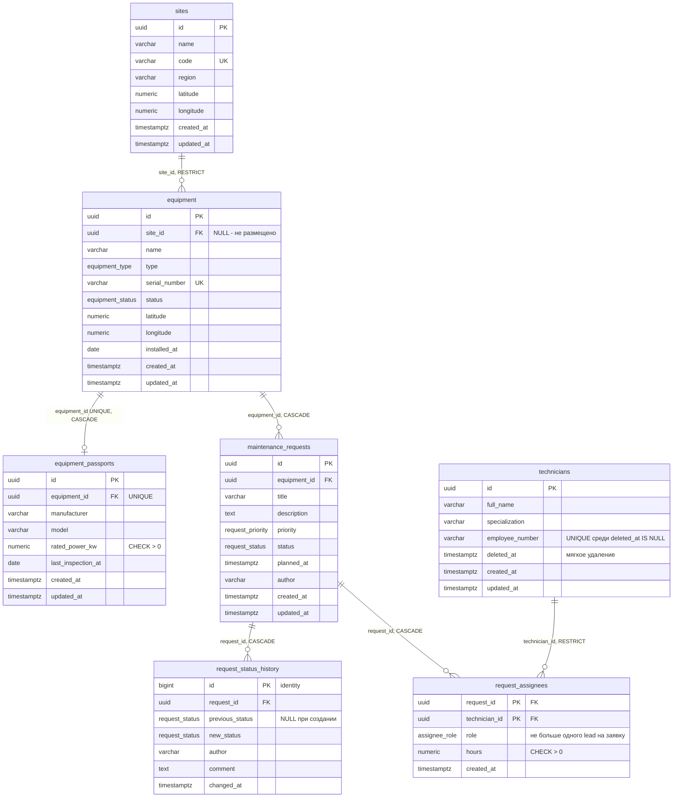

# Схема базы данных

## Связи

| Связь                     | Тип | Реализация                                                                                                                                    |
| ------------------------- | --- | --------------------------------------------------------------------------------------------------------------------------------------------- |
| Площадка → Оборудование   | 1:N | `equipment.site_id`, `ON DELETE RESTRICT`: площадку с оборудованием удалить нельзя                                                            |
| Оборудование → Паспорт    | 1:1 | отдельная таблица `equipment_passports` с `UNIQUE (equipment_id)`, `ON DELETE CASCADE`                                                        |
| Оборудование → Заявки     | 1:N | `maintenance_requests.equipment_id`, `ON DELETE CASCADE` (см. правила удаления)                                                               |
| Заявка → История статусов | 1:N | `request_status_history.request_id`, `ON DELETE CASCADE`; строки не редактируются и не удаляются — триггер `request_status_history_immutable` |
| Заявки ↔ Специалисты      | N:M | `request_assignees` с полями `role` и `hours`; составной первичный ключ `(request_id, technician_id)` исключает повторное назначение          |

## Нормализация

- **1НФ** — все значения атомарны: координаты хранятся двумя числовыми колонками, а не строкой
  «lat,lon»; список исполнителей — строками связующей таблицы, а не массивом в заявке.
- **2НФ** — в единственной таблице с составным ключом (`request_assignees`) неключевые атрибуты
  `role` и `hours` зависят от пары «заявка — специалист» целиком: роль и трудозатраты имеют смысл
  только для конкретного назначения.
- **3НФ** — нет транзитивных зависимостей: название, регион и координаты площадки хранятся один
  раз в `sites`, а не повторяются в каждой единице оборудования; данные специалиста — в
  `technicians`, а не в каждом назначении; паспортные данные вынесены в свою таблицу, потому что
  описывают изделие, а не эксплуатацию, и заполняются не для всего оборудования.
- Справочные значения с фиксированным набором (тип и статус оборудования, приоритет и статус
  заявки, роль в бригаде) — перечисления PostgreSQL с именованными типами: один тип
  `request_status` используется и в заявке, и в двух колонках журнала.
- Даты — `timestamptz` (сравнения между часовыми поясами однозначны), дата установки и поверки —
  `date` (время суток не имеет смысла), количества — `numeric` с заданной точностью, а не `float`.

## Правила удаления

| Действие                                  | Что происходит                                                                                                                                                                                                   |
| ----------------------------------------- | ---------------------------------------------------------------------------------------------------------------------------------------------------------------------------------------------------------------- |
| Удалить площадку с оборудованием          | отклоняется БД (`RESTRICT`) → API отвечает 409                                                                                                                                                                   |
| Удалить оборудование с открытыми заявками | отклоняется сервисом → 409 (контракт Кейса 2)                                                                                                                                                                    |
| Удалить оборудование без открытых заявок  | каскадом удаляются паспорт, закрытые заявки, их журнал и назначения; штатный путь для выведенного из эксплуатации оборудования — статус `decommissioned`, удаление предназначено для ошибочно заведённых записей |
| Удалить заявку                            | каскадом удаляются журнал и назначения (журнал разрешает только каскад — `pg_trigger_depth() > 1`)                                                                                                               |
| Удалить специалиста                       | мягкое удаление (`deleted_at`); внешний ключ `RESTRICT` не даёт физически удалить специалиста с назначениями                                                                                                     |

## Идентификаторы и метки времени

- Первичные ключи — `uuid`, генерируются в БД (`gen_random_uuid()`): ссылки можно готовить до
  вставки и переносить данные между окружениями без коллизий.
- Журнал статусов — `bigint GENERATED BY DEFAULT AS IDENTITY`: записи только добавляются, а
  монотонный ключ даёт естественный порядок событий.
- `created_at`/`updated_at` заполняются приложением, `DEFAULT now()` страхует прямые вставки.
